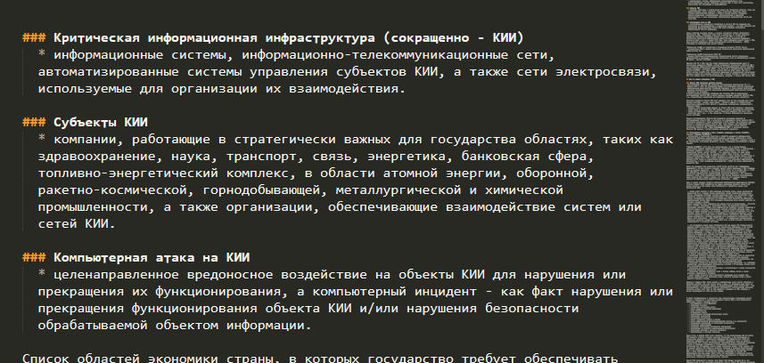
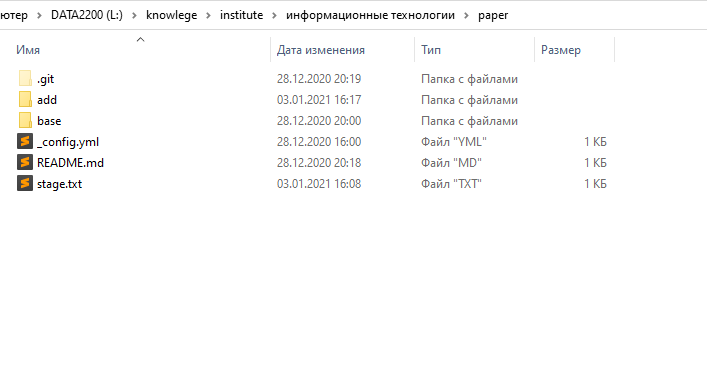

Отчет по выполнению работы

  1. Зарегистрировался на github.

  2. Скачал и установил Git

  3. Заливал файлы через консоль (история команд на рисунке 1)

  4. Для форматирования страницы использовал чистый Markdown

 

  5. Файлы HTML не делал.

[назад](/README.md)
