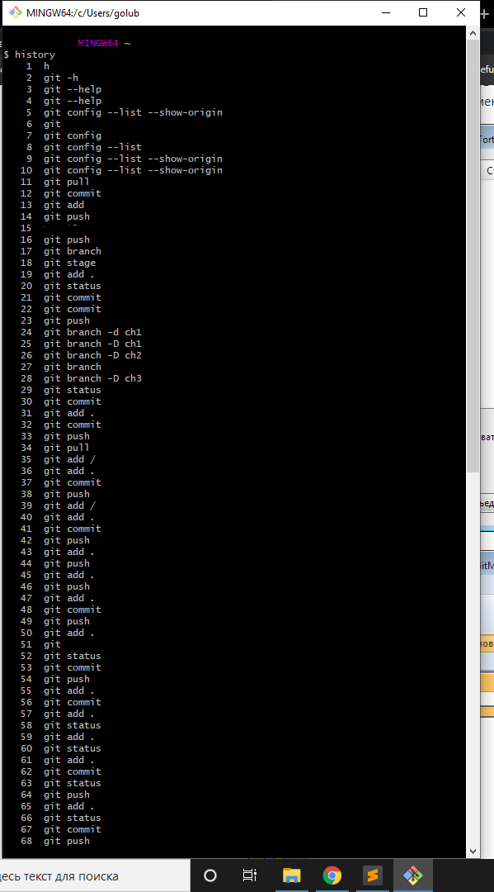

Отчет по выполнению работы

  1. Зарегистрировался на github.

  1. Скачал и установил Git

  1. Заливал файлы через консоль (история команд на рисунке 1)

		

  1. Для форматирования страницы использовал чистый Markdown

		 

  1. Файлы HTML не делал.

		

[назад](/README.md)
